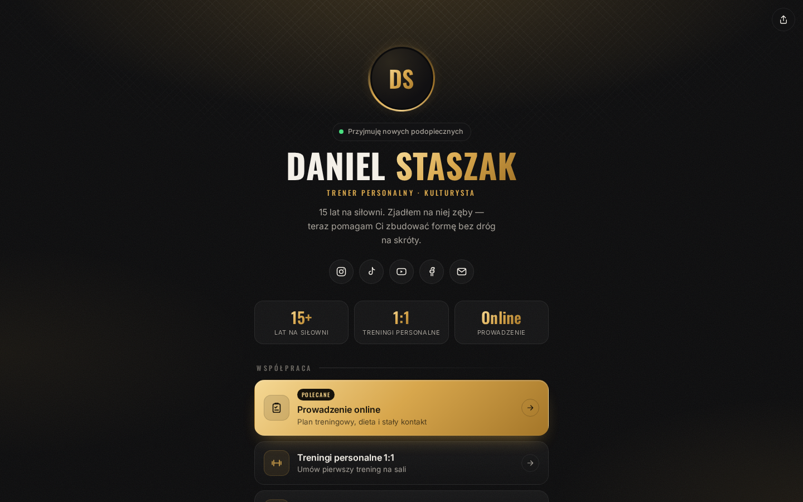

# Daniel Staszak — strona z linkami

Własna strona typu „linktree” dla **Daniela Staszaka**: trenera personalnego i kulturysty z 15 latami na siłowni.
Działa na własnym hostingu i domenie, bez zewnętrznych serwisów, trackerów i Google Fonts.

| Telefon | Komputer |
|---|---|
|  |  |

## Co tu jest

- **Ekran ładowania:** animowany ludzik wyciska sztangę nad głowę (push press). Gryf ugina się, a talerze bujają przy ruchu. Przy kolejnych wejściach w tej samej sesji loader jest krótszy, a dotknięcie go pomija.
- **Przekierowanie:** po kliknięciu linku ludzik robi uginanie z hantlem, biceps „pompuje się” i świeci na złoto. Potem strona przechodzi pod wybrany adres. Animację można anulować przyciskiem lub klawiszem Esc.
- **Styl „Iron & Gold”:** czerń, kreda i mosiądz talerzy. W tle jest delikatne radełkowanie, jak na gryfie sztangi. Fonty to Oswald i Inter.
- Wyróżniony złoty link, statystyki, ikony social mediów, motto i przycisk „Udostępnij”.
- Gotowy podgląd linku przy wysyłaniu na Instagramie, Messengerze czy WhatsAppie (`og-image.png`).
- Strona szanuje ustawienie „ogranicz ruch” w systemie i działa na telefonie z notchem.

## Edycja treści

**Wszystko zmieniasz w jednym pliku:** [`assets/js/config.js`](assets/js/config.js).

- `profile`: imię, nazwisko, opis, status („Przyjmuję nowych podopiecznych”) i zdjęcie.
- `stats`: trzy kafelki ze statystykami.
- `socials`: okrągłe ikony pod opisem.
- `links`: główne przyciski. `type: "heading"` to nagłówek sekcji, a `featured: true` to złoty, wyróżniony link.
- `motto` i `footer`.
- `redirect` i `loader`: włączenie, wyłączenie i czas trwania animacji.

Zasady dla pola `url`:

| Wartość | Efekt |
|---|---|
| `"https://…"` | normalny link z animacją przekierowania |
| `"#"` | link widoczny, po kliknięciu pokazuje „Ten link już wkrótce 💪” |
| `""` | link ukryty |
| `"mailto:…"` / `"tel:…"` | otwiera pocztę lub telefon (bez animacji) |

Dostępne ikony: `instagram`, `tiktok`, `youtube`, `facebook`, `mail`, `phone`, `chat`, `dumbbell`, `clipboard`, `calendar`, `apple`, `trophy`, `star`, `link`.

### Zdjęcie profilowe

Wrzuć zdjęcie, na przykład `assets/img/daniel.jpg` (najlepiej kwadratowe, około 400×400 px). Potem ustaw w `config.js`:

```js
avatar: "assets/img/daniel.jpg",
```

Gdy zdjęcia nie ma, wyświetla się złoty monogram „DS”.

## Podgląd lokalny

```bash
npx serve .
# albo
python3 -m http.server 8080
```

Potem otwórz `http://localhost:8080`.

## Publikacja na GitHub Pages

1. W repozytorium wejdź w **Settings → Pages**.
2. Jako **Source** wybierz *Deploy from a branch*, a jako gałąź `main` i folder `/ (root)`.
3. Po chwili strona będzie dostępna pod `https://<użytkownik>.github.io/<repozytorium>/`.

Plik `.nojekyll` jest celowo dodany, żeby GitHub serwował pliki bez przetwarzania.

### Własna domena

1. W **Settings → Pages → Custom domain** wpisz domenę, np. `danielstaszak.pl`. GitHub sam utworzy plik `CNAME`.
2. U rejestratora domeny ustaw rekordy DNS:
   - domena główna: rekordy **A** na `185.199.108.153`, `185.199.109.153`, `185.199.110.153` i `185.199.111.153`;
   - subdomena `www`: rekord **CNAME** na `<użytkownik>.github.io`.
3. Gdy DNS się rozpropaguje, zaznacz **Enforce HTTPS**.
4. W `index.html` zmień `og:image` na pełny adres, np. `https://danielstaszak.pl/assets/img/og-image.png`. Dzięki temu podgląd linku zadziała wszędzie.

Strona to czysty HTML, CSS i JS bez budowania. Na zwykły hosting (np. przez FTP) przenosisz ją, kopiując cały folder.

## Struktura

```
index.html            – szkielet strony
assets/js/config.js   – TREŚCI (edytuj tutaj)
assets/js/figures.js  – animowane ludziki (SVG + kinematyka)
assets/js/main.js     – logika: render linków, loader, przekierowanie, udostępnianie
assets/css/style.css  – wygląd
assets/fonts/         – Oswald + Inter (licencja SIL OFL, hostowane lokalnie)
assets/img/           – favicon, ikona iOS, obrazek podglądu linku
```
